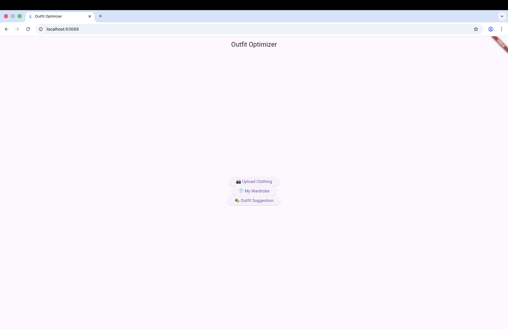
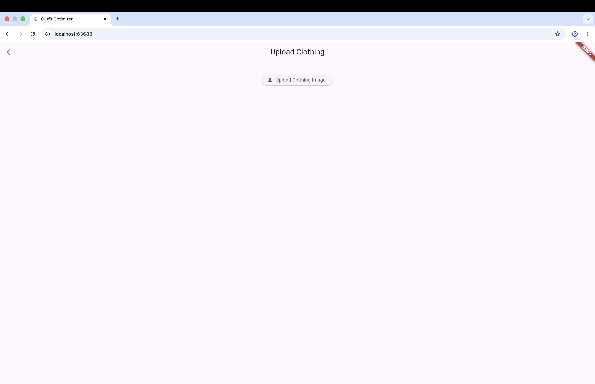
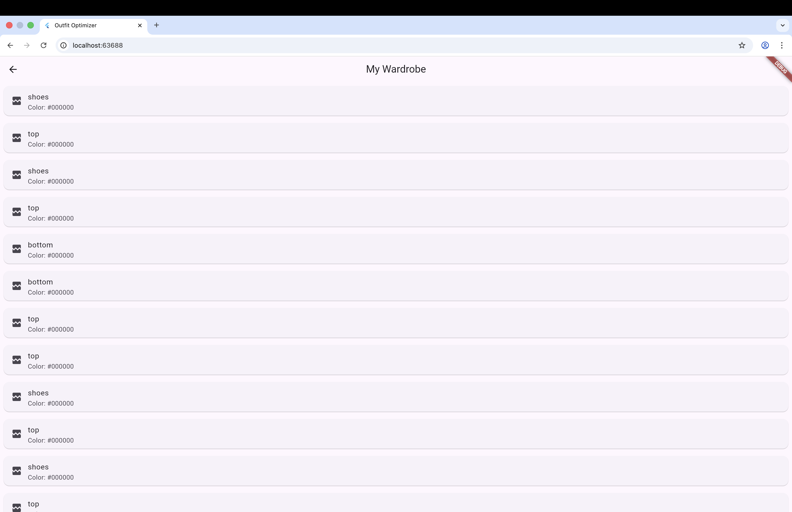
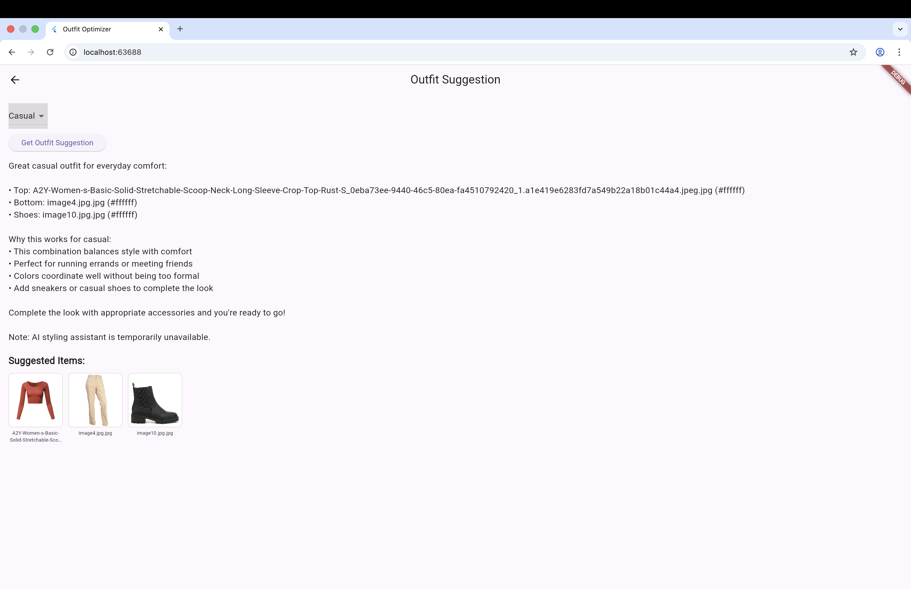
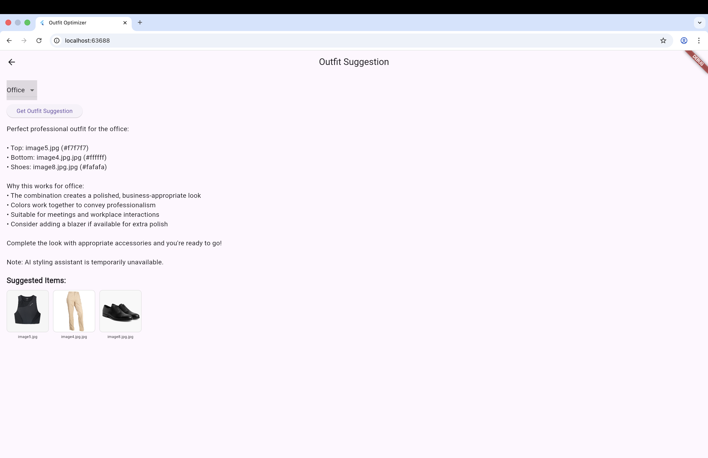
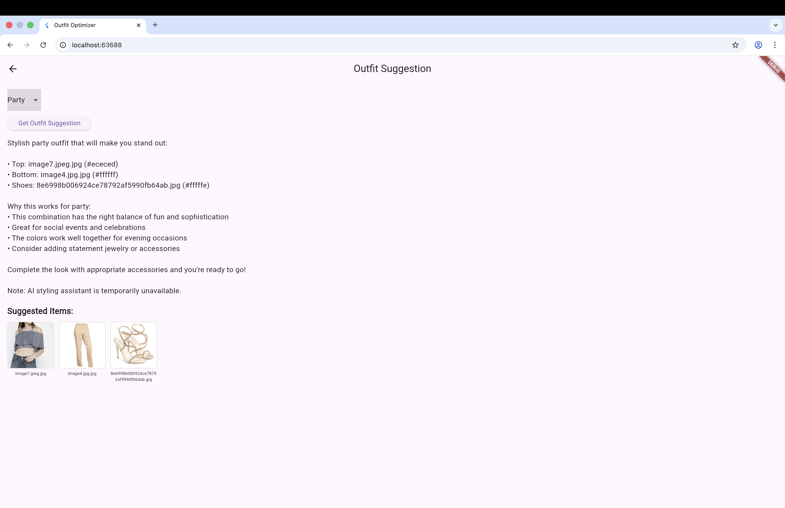

#  Outfit Optimizer

An AI-powered application that helps users organize their wardrobe and generate outfit suggestions based on events like casual, office, or party.

---

##  Features

* Upload clothing images
* Automatic clothing classification (top, bottom, shoes, etc.)
* Color extraction from images
* Smart outfit recommendations based on event type
* REST API backend using FastAPI
* Flutter frontend for interactive UI

---

##  Project Structure

```
Outfit-Optimizer/
├── outfit_optimizer_BE/     # FastAPI backend
├── outfit_optimizer_app_FE/ # Flutter frontend
```

---

##  Backend Setup (FastAPI)

### 1. Navigate to backend

```
cd outfit_optimizer_BE
```

### 2. Create virtual environment

```
python3 -m venv venv
source venv/bin/activate
```

### 3. Install dependencies

```
pip install --upgrade pip
pip install -r requirements.txt
```

### 4. Run the server

```
uvicorn main:app --reload --host 127.0.0.1 --port 8000
```

### 5. Access API

* Base URL: [http://127.0.0.1:8000](http://127.0.0.1:8000)
* Docs: [http://127.0.0.1:8000/docs](http://127.0.0.1:8000/docs)

---

##  Frontend Setup (Flutter)

### 1. Navigate to frontend

```
cd outfit_optimizer_app_FE
```

### 2. Install dependencies

```
flutter pub get
```

### 3. Run the app (Web)

```
flutter run -d chrome
```

---

##  API Endpoints

### Health Check

```
GET /health
```

### Upload Image

```
POST /upload/
```

### Get Images

```
GET /images
```

### Get Outfit Suggestions

```
GET /suggest/?event=casual
```

---

##  Usage Flow

1. Start backend server
2. Run Flutter frontend
3. Upload clothing images
4. View wardrobe items
5. Generate outfit suggestions

---

##  Notes

* Backend must be running before frontend
* Ensure port `8000` is available
* If no items are uploaded, suggestions will not be generated

---

##  Tech Stack

* **Backend:** FastAPI, Python
* **Frontend:** Flutter (Dart)
* **ML Components:** Image classification, color extraction

---

## Screenshots & Examples

###  Home Screen


###  Upload Clothing Item


###  Wardrobe View


###  Outfit Suggestions (Casual / Office / Party)





##  Future Improvements

* Better ML model for clothing classification
* User authentication
* Cloud deployment
* Improved UI/UX


